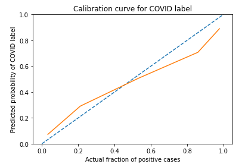
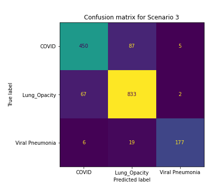
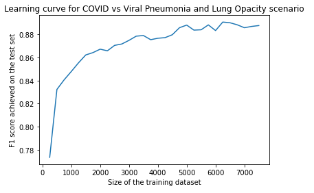

# Master thesis project repository

This repostory hosts code for my masters thesis project: **The usability of radiomics feautes for COVID-19 diagnosis from chest scans**

----

The goal was to create a classifier that performs differentation between COVID-19 patients and other cases (either with different respirator disease or healthy), using small number of disriminative radiomic features.

The goal was achieved by creating a classifier that consistently selects 20 features from large set of thousands of features, same features being selected regardless of the size of the training set ensuring their stability.

----

The classifier was well calibrated, the probabilities of ongoing COVID-19 disease process that are returned by the model reflect the actual proportions of correctly classified cases. The calibration curve can be found below.

---

Inspection of confusion matrix shows that the classifier achieves accuracies that may suggest that after some improvements, model could be used clinically as a additional tool for doctors to differentiate between different respiratory diseases.

---

Inspection of learning curves shows that large dataset indeed helps in achieving well performing classifiers.

